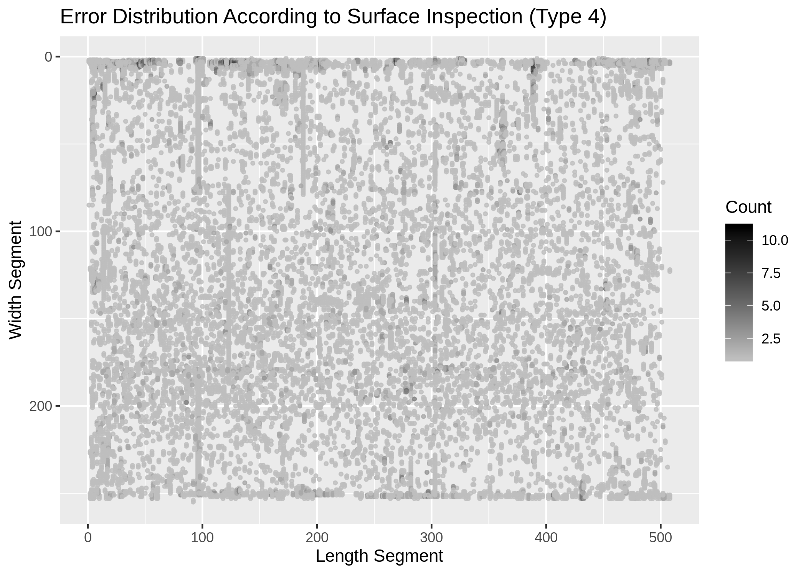
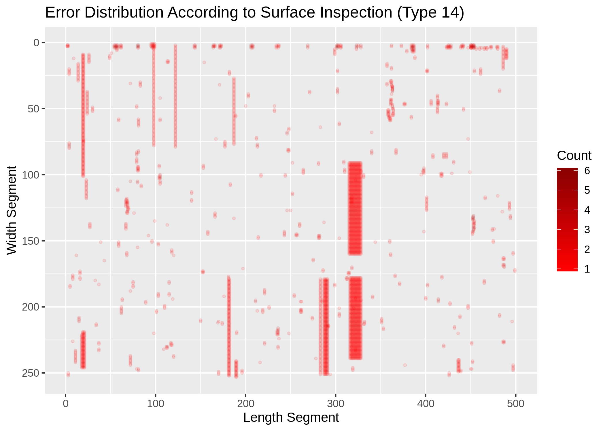
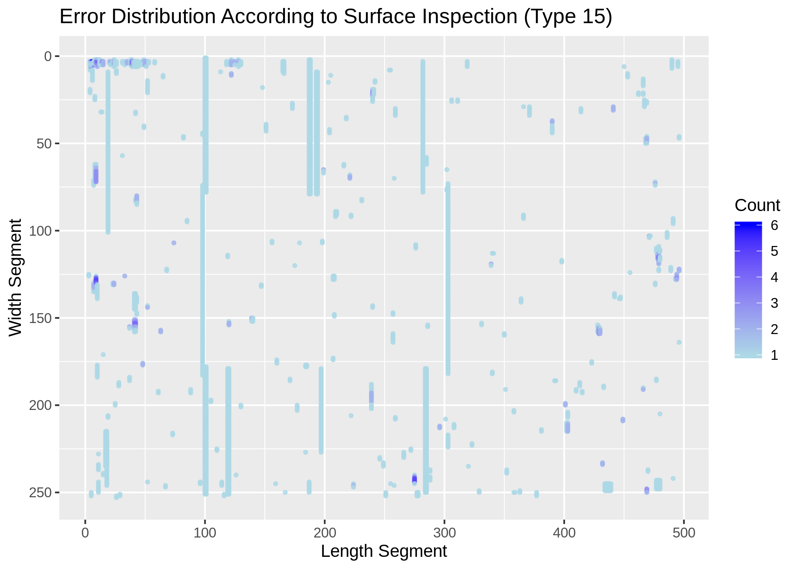
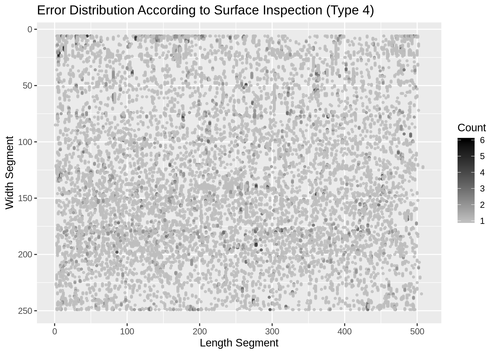
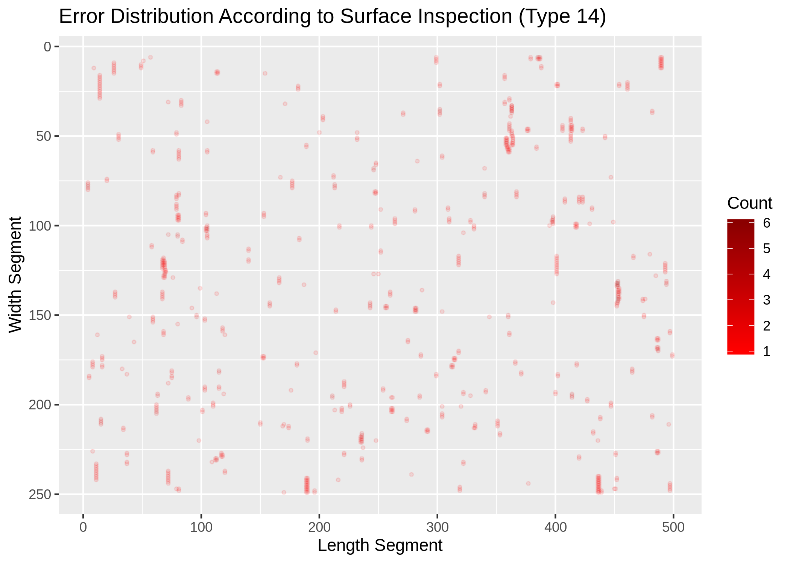
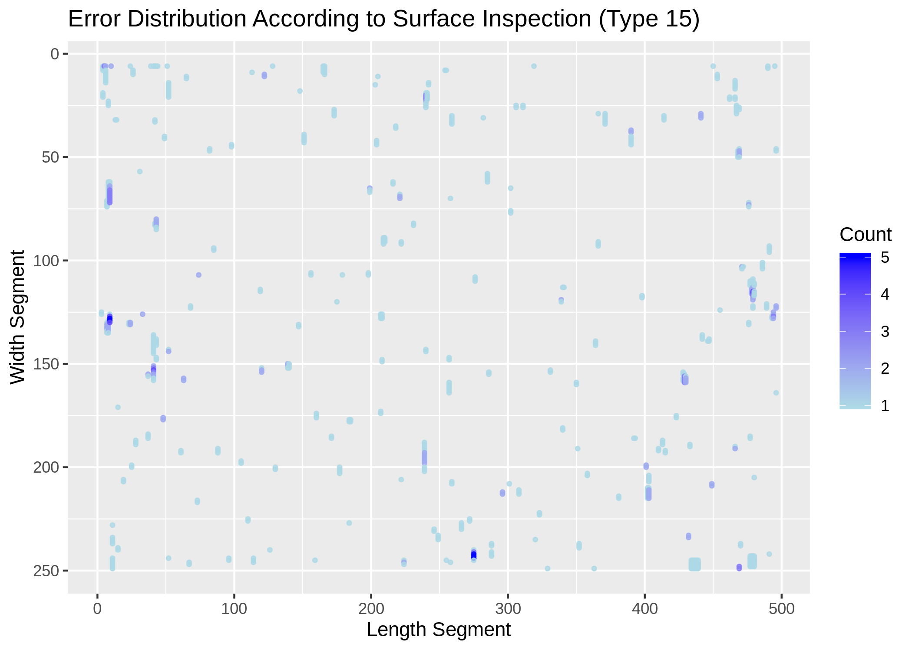

# Treating/Merging/Intial Modeling of Steel Slab Data
This repo shows the five step process of merging and reducing the data sets into a workable format for the second of my advanced projects completed for my master's degree at Jacobs University Bremen.

Data was provided by a university company partner, and, with business partner direction, I merged and reduced these files to better assess the frequency and causes of three different error types seen in the production of steel slabs.
This was done in five seperate steps, throughout which I merged data from various sources, merged the new information with data from previous steps, reduced the data based on professor and company direction, and, in the final step, created a few proto-models to gain a general understanding of the importance of different features on the presence of an error on the surface of a given slab. The results were then used to improve production and reduce error frequency.

## General Overview
### Step 1
In this step I used key information from the main identifying data sets to create an identifying matrix. This matrix is used throughout the remained of the analysis to identify the specific slabs of interest. The process of creating this matrix is handled in both the `Step1/Step1_CreatingIdentMatrix.Rmd` and `Step1/Step1_IdentMat.R` files, although the Rmd file provides a better overview of the process. The Rmd file has also been knit into an HTML file, `Step1/Step1_CreatingIdentMatrix.html`.

### Step 2
Step two was broken into two parts:
* Part 1, in which the SGA data was prepped for merging
* Part 2, in which the full SGA data set was filtered based on the indentifying matrix created in Step 1

In part 1 various features were dropped from the data set which were constant, or by comanpy instruction. The distributions of the remaining features in the SGA data set were reviewed then for interesting and/or abnormal behaviors. This information was used to detect and drop any remaining constant variables.

In part 2 the reduced data set was filtered using the identifying matrix created in Step 1. The resulting data set was then compared against data files previously created by my professor, to review the accuracy of the creation steps. All data was succesfully validated.

### Step 3
Step three was broken into three parts:
* Part 1, in which the BZA data was prepped and the distributions of error rates and other interseting features were reviewed.
* Part 2,
* Part 3,

#### Part 1
In part 1, `Step3_PreppingBZAData.Rmd`, I prepped the BZA data for analysis by restricting the features to those of insterest, and ordering the observations in increasing order. I then reviewed the geometric dristributions of the type 4, 14, and 15 errors. After finding and removing any abnormally high error rate counts, I once again reviewed the geometric error rate distributions. Below I have included the plots showing the geom. error rate distributions before, and after removing the high error rate counts.

##### Before

##### After

I then reviewed feature distributions, and dropped those features which were not relevent to the analysis and/or dropped those observations which seemed to either be outliers or had extremely small observation rates.

#### Part 2
In part two I filtered the BZA data based on the identifying matrix.

#### Part 3
In part three I double checked that there were no remaining observations which could be found in both the SGA and BZA data. I then preformed the final processing on the SGA data.

### Step 4
In step four I dropped observations from the data based on the amount of the slab which would be scrapped in production. This was done for both the SGA and BZA data.

### Step 5
Step five is comprised of two seperate steps, only the first of which truly belongs to the preprocessing/treatment process. This first file is refered to as `Step5_FinalMerge.Rmd` and it constitutes the final merge of all preprocessed and created data in the project. The resulting data created in this step was then used in all further analysis of the slab production and for all modeling of error rate presence.

The second file in step five is `Anna_ProtMod.Rmd`, and it is in this file that all proto-models were created and evaluated.

## Requirements/Data
### Data
The data used in this analysis is entirely proprietary, and therefore cannot be shared here.
### Requirements
As the data connot be provided, there is really no way to run this project. That being said, if you wish to quickly install the libraries used in this project, I have included a requirements.txt file with an `install.packages` line to quickly support this.
